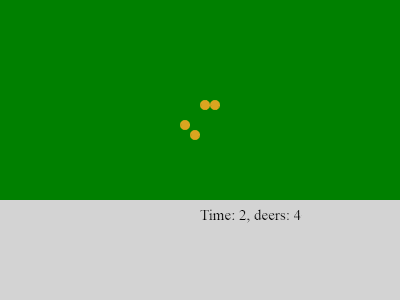

# predator-prey
Predator-prey game with Node.js

1. Install node.js
2. *npm init -f*
3. *npm install --save jest*

    Jest pulls many other useful things, like lodash

4. Replace in package.json test value to jest.

5. *npm run test*

6. to get quick results:

*node quick_run.js*

7. *npm install --save express*

8. *npm install --save socket.io*

9. *node server.js*

10. Open browser, go to:

  *localhost:8081*

# Run with docker

1. There Dockerfile from this repo
2. *docker build . -t predator-prey*
3. *docker run -p 8081:8081 predator-prey*

The same image is available here:

https://hub.docker.com/r/tprlab/predator-prey